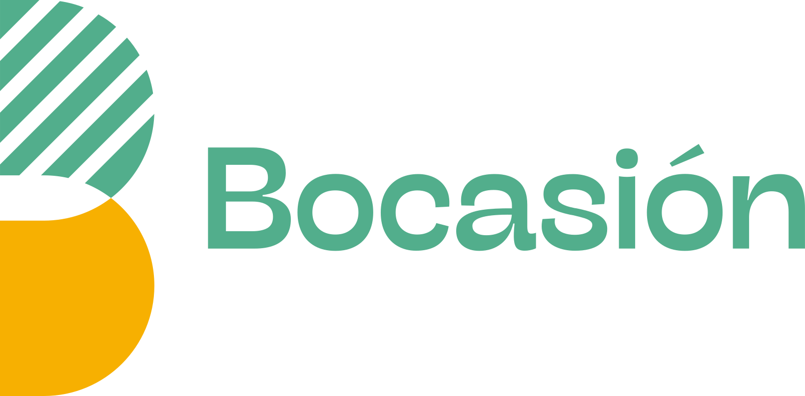
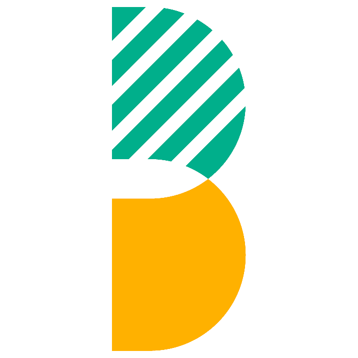

<a id="readme-top"></a>
<!-- SHIELDS -->

<p align='center'>
  &nbsp;
  &nbsp;
  &nbsp;
  &nbsp;
</p>

<!-- PROJECT LOGO -->
<br>
<div align="center">
   
   <h3 align="center">Intranet Ventas</h3>
   <p align="center">
     Aplicación de escritorio TPV para BOCASIÓN S.A.C.
     <br>
     <a href="https://github.com/hexed-AAL1X/Bocasion-TPV"><strong>Explorar el repositorio »</strong></a>
     <br>
     <br>
     <a href="https://github.com/hexed-AAL1X/Bocasion-TPV/releases">Descargas</a>
     ·
     <a href="https://github.com/hexed-AAL1X/Bocasion-TPV/issues/new?labels=bug">Reportar error</a>
     ·
     <a href="https://github.com/hexed-AAL1X/Bocasion-TPV/issues/new?labels=enhancement">Pedir mejora</a>
   </p>
</div>

<!-- TABLE OF CONTENTS -->
<details>
  <summary>Tabla de contenidos</summary>
  <ol>
    <li>
      <a href="#sobre-el-proyecto">Sobre el proyecto</a>
      <ul>
        <li><a href="#tecnologias">Tecnologías</a></li>
      </ul>
    </li>
    <li><a href="#avisos-importantes">Avisos importantes</a></li>
    <li>
      <a href="#primeros-pasos">Primeros pasos</a>
      <ul>
        <li><a href="#requisitos">Requisitos</a></li>
        <li><a href="#instalacion">Instalación</a></li>
      </ul>
    </li>
    <li><a href="#contribuir">Contribuir</a></li>
    <li><a href="#contacto">Contacto</a></li>
  </ol>
</details>
<br>

<!-- ABOUT THE PROJECT -->
<a id="sobre-el-proyecto"></a>***Sobre el proyecto***


<div align="center">
  
</div>

**Intranet Ventas** es la aplicación de escritorio para cajas y puntos de venta de **BOCASIÓN S.A.C.** Permite operar el mostrador, emitir documentos y consultar información de clientes contra la base de datos de la empresa.

Incluye, entre otras funciones

* Emisión de boletas y facturas desde el TPV
* Consulta de DNI / RUC para completar datos del cliente
* Monitor de ventas por caja, liquidación y apertura de caja
* Reportes e impresiones habituales en sede
* Conexión a la base de datos de la empresa o al entorno de pruebas
* Actualizaciones para mantener las cajas al día

<a id="tecnologias"></a>
### Tecnologías
* &nbsp;
* &nbsp;
* &nbsp;
* &nbsp;
* &nbsp;
* &nbsp;
* &nbsp;
<p align="right">(<a href="#readme-top">volver arriba</a>)</p>

<!-- IMPORTANT NOTICES -->
<a id="avisos-importantes"></a>***Avisos importantes***


> [!NOTE]
> Para instalar y usar Intranet Ventas, ten en cuenta lo siguiente
>
> | Requisito | Descripción |
> |-----------|-------------|
> | Sistema operativo |   |
> | Entorno de desarrollo |  (recomendado 20+) |
> | Base de datos | SQL Server Nava (producción o pruebas) |
> | Red | Internet o red de sede según el entorno elegido |

> [!IMPORTANT]
> En las cajas instaladas la app apunta a la base de datos de **producción**. El entorno de **pruebas** se usa en desarrollo técnico. No compartas el archivo `.env` ni contraseñas en el repositorio.
<p align="right">(<a href="#readme-top">volver arriba</a>)</p>

<!-- GETTING STARTED -->
<a id="primeros-pasos"></a>***Primeros pasos***


Instrucciones para configurar el proyecto en local. Sigue estos pasos.

<a id="requisitos"></a>
### Requisitos
* Node.js 20 o superior
* npm
* Acceso a SQL Server (pruebas o producción, según tu `.env`)
* En Linux, para el instalador AppImage, permisos de ejecución

<a id="instalacion"></a>
### Instalación

#### Opción A — Usar el instalador (cajas)
1. Descarga la última versión en [Releases](https://github.com/hexed-AAL1X/Bocasion-TPV/releases)
2. En Windows, ejecuta el instalador `.exe`
3. En Linux, da permisos y abre el AppImage o el script `Intranet-Ventas.sh`

#### Opción B — Desarrollo local
1. Clona el repositorio
   ```sh
   git clone https://github.com/hexed-AAL1X/Bocasion-TPV.git
   ```
2. Entra a la carpeta del proyecto
   ```sh
   cd Bocasion-TPV
   ```
3. Instala dependencias
   ```sh
   npm install
   ```
4. Crea tu `.env` en la raíz (copia la configuración de SQL de pruebas/producción que te indiquen)
5. Arranca en modo desarrollo
   ```sh
   npm run dev
   ```
6. (Opcional) Generar instaladores
   ```sh
   npm run build:win
   # o
   npm run build:desktop
   ```
<p align="right">(<a href="#readme-top">volver arriba</a>)</p>

<!-- CONTRIBUTING -->
<a id="contribuir"></a>***Contribuir***


Las contribuciones ayudan a mejorar el proyecto. Si tienes una sugerencia, puedes hacer un fork y abrir un pull request. ¡Gracias por aportar!

1. Haz fork del proyecto
2. Crea una rama para tu mejora (`git checkout -b feature/NuevaMejora`)
3. Confirma tus cambios (`git commit -m "Agrega nueva mejora"`)
4. Sube la rama (`git push origin feature/NuevaMejora`)
5. Abre un pull request
<p align="right">(<a href="#readme-top">volver arriba</a>)</p>

<!-- CONTACT -->
<a id="contacto"></a>***Contacto***

<p align="center">
  <a href="mailto:hexed_aal1x.ops@proton.me"></a>
  <a href="https://www.instagram.com/hexed_aal1x"></a>
  <a href="https://www.linkedin.com/in/leonardo-bravo-4120b8228/"></a>
</p>
<p align="right">(<a href="#readme-top">volver arriba</a>)</p>
